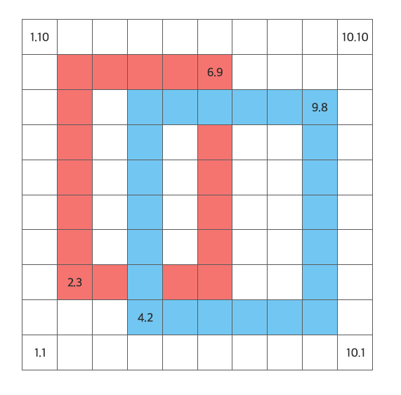

# 가장 큰 영역 찾기(LargerClosedArea)

다음 그림과 같은 그리드 영역 위에는 두 개의 좌표로 구성된 직사각형들이 있습니다. 주어진 직사각형은 기본적으로 1개 이상의 폐구간을 가지고 있습니다. 폐구간의 크기는 외곽 셀을 제외한 셀의 개수입니다. 예제의 그림에서 폐구간은 3개이며, 크기는 5, 4, 10 입니다. 직사각형간의 교차가 발생하면 폐구간이 새로 생기거나, 사라질 수도 있습니다. 주어진 입력에서 가장 큰 폐구간의 크기를 출력하는 프로그램을 작성해 주시기 바랍니다.

;

## 입력

입력은 표준 입력(stdin)으로 주어집니다.
첫 번째 줄에는 N이 주어집니다. N은 직사각형의 개수입니다. (2 <= N <= 10)
두 번째 줄에는 N의 개수만큼 두 개의 좌표 쌍이 주어집니다. (X1,Y1,X2,Y2) 좌표 쌍은 모두 콤마(,)로 구분하며, 순서대로 첫 번째 좌표의 X,Y 두 번째 좌표의 X,Y 정수 값입니다. (1 <= X,Y <= 100).

## 출력

출력은 표준 출력(stdout)으로 이루어집니다.
가장 큰 폐구간의 크기를 출력합니다.